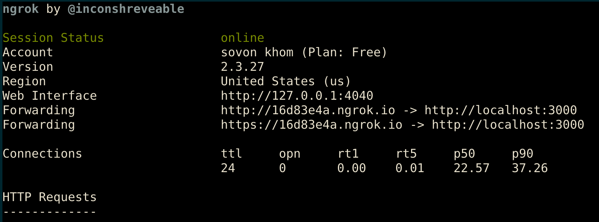
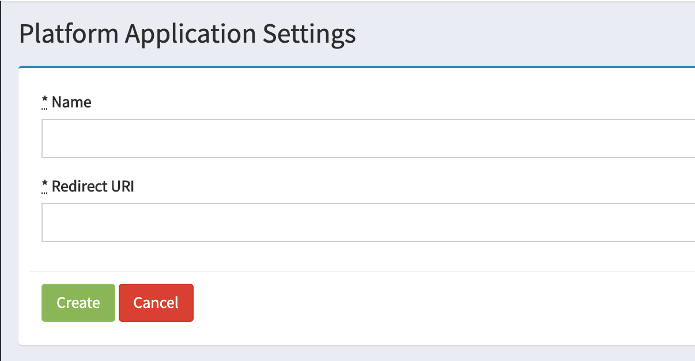

# Bongloy demo marketplace

Bongloy demo marketplace is a Ruby on rails app which demonstrates how to use Bongloy

## Getting started

#### Installation

    $ git clone https://github.com/khomsovon/bongloy-demo-marketplace.git
  ```sh
  cd bongloy-demo-marketplace
  ```
  Install Ruby on Rails dependency
  ```sh
  bundle install
  ```
#### Setup
  After that, you have to create database, migrate and finally seed some dummy data for demonstration purpose.
  ```sh
  rails db:create && rails db:migrate && rails db:seed
  ```

Fill in your environment variable from your Bongloy account in `.env` file.
You can register and access [here](https://staging-sandbox.bongloy.com) to get these confidential keys
```sh
PUBLISHABLE_KEY=bongloy_publishable_key
SECRET_KEY=bongloy_secret_key
CLIENT_ID=bongloy_client_key
CLIENT_SECRET=bongloy_client_secret
BASE_URL=https://16d83e4a.ngrok.io
BONGLOY_CONNECT_URL=https://api-staging.bongloy.com/oauth/token
```

Run Rails server
```sh
rails server
```
Then you can access application by this url `http://localhost:3000`

## Usage

After finish all the step above successfully, you have some demonstration data for login.
Just go to login `http://localhost:3000/users/sign_in` with default

```sh
email: test@exa`mple.com
password: 12345678
```
Or you can sign up new one by this url `http://localhost:3000/users/sign_up` or just click and `Register` menu on homepage

> **Note:** You have to connect to Bongloy account to gain access product feature.
Just navigate to `My Account` and click on  `Connect with Bongloy` and then you good to go.

As Bongloy require `https` for redirect back when connect with it, we recommend you to use `ngrok` for testing purpose.

Just go to [ngrok](https://ngrok.com) download and follow their instruction.

then you can run `ngrok` to serve this application.

```sh
./ngrok http 3000
```

You will get both http and https url like image below



After that you can copy https url to past in Bongloy connected account and put it in `Redirect URI` on `Platform Application Settings` under `Connect` menu



That's all for instruction!
